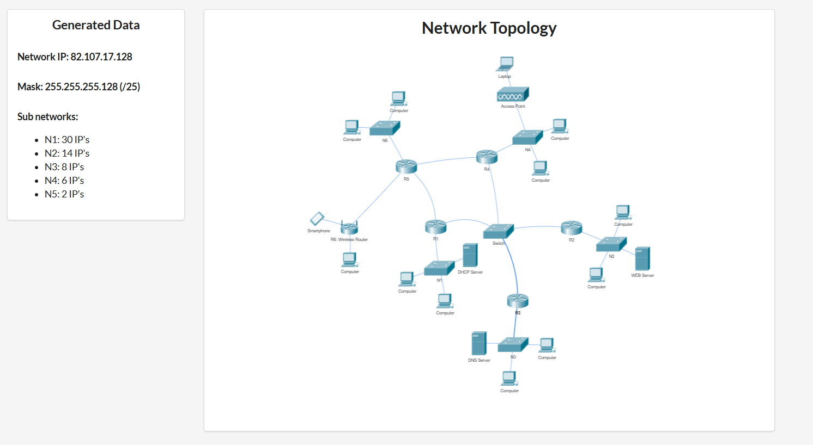

# Network Topology Project

> Project built in **Cisco Packet Tracer** — full network simulation featuring VLSM subnetting, routing, DHCP, DNS, and a WEB server.

---

##  Overview

The network is designed using VLSM (Variable Length Subnet Masking) over a single address space, divided into **5 subnets** interconnected through routers and a central switch.

### General Information

| Property          | Value                  |
|-------------------|------------------------|
| **Network IP**    | `82.107.17.128`        |
| **Subnet Mask**   | `255.255.255.128` (/25)|
| **Total Hosts**   | 126                    |
| **Simulator**     | Cisco Packet Tracer    |

---

##  Subnets (VLSM)

| Subnet   | IPs Allocated | Purpose                          |
|----------|--------------|----------------------------------|
| **N1**   | 30 IPs       | Main LAN (Switch + DHCP Server)  |
| **N2**   | 14 IPs       | LAN with WEB Server              |
| **N3**   | 8 IPs        | LAN with DNS Server              |
| **N4**   | 6 IPs        | Wireless LAN (Access Point)      |
| **N5**   | 2 IPs        | Point-to-point link              |

---

## Devices

### Routers
| Device  | Role                                         |
|---------|----------------------------------------------|
| **R1**  | Core router — connected to the central Switch|
| **R2**  | Router for N2 (WEB Server LAN)               |
| **R3**  | Router for N3 (DNS Server LAN)               |
| **R4**  | Router for N4 (Wireless LAN)                 |
| **R5**  | Router for N5 / inter-router link            |
| **R6**  | Wireless Router (extends network to Smartphone)|

### Switches & Access Points
| Device           | Role                                        |
|------------------|---------------------------------------------|
| **Switch**       | Central switch — connects R1, R2, R3        |
| **N1** (switch)  | N1 LAN switch — DHCP Server + computers     |
| **N2** (switch)  | N2 LAN switch — WEB Server + computers      |
| **N3** (switch)  | N3 LAN switch — DNS Server + computers      |
| **N4** (switch)  | N4 LAN switch — Access Point + computers    |
| **N5** (switch)  | N5 LAN switch — computers                  |
| **Access Point** | Wireless AP in N4 (connects Laptop)         |

### Servers
| Server          | Function                                    |
|-----------------|---------------------------------------------|
| **DHCP Server** | Automatically assigns IP addresses          |
| **DNS Server**  | Resolves domain names to IP addresses       |
| **WEB Server**  | Hosts a locally accessible website          |

### End Devices
-  **Computers** — distributed across all subnets
-  **Smartphone** — connected wirelessly through R6 (Wireless Router)
-  **Laptop** — connected wirelessly through the Access Point (N4)

---

##  Network Topology



---

## 🔗 Connection Architecture

```
Smartphone ──── R6 (Wireless Router)
                       │
               R5 ─────┤
              /  │      \
            N5   │       R4 ──── N4 (Access Point ──── Laptop)
                 │
                 R1 ───── Switch ─── R2 ──── N2 (WEB Server)
                 │           │
                N1           R3 ──── N3 (DNS Server)
           (DHCP Server)
```

---

## ⚙️ Implemented Features

- **VLSM Subnetting** — efficient IP address space allocation
- **Routing** — static/dynamic routing between all routers
- **DHCP** — automatic IP assignment for end devices
- **DNS** — domain name resolution for the web server
- **WEB Server** — web pages accessible from any device on the network
- **Wireless** — connectivity via Access Point and Wireless Router
- **End-to-end connectivity** — ping between all subnets
